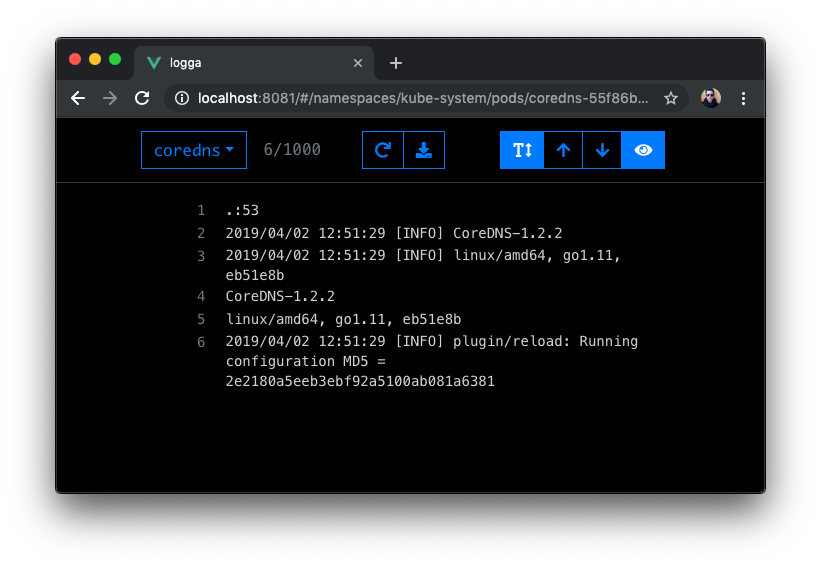

# logga
[](https://travis-ci.com/amimof/logga) [](https://godoc.org/github.com/amimof/logga) [](https://goreportcard.com/report/github.com/amimof/logga) [](http://gocover.io/github.com/amimof/logga)

----

logga is an easy to use and powerful container log dashboard for Kubernetes. It's used by application teams and sysadmins to effortlessly view container logs in a namespace using a web browser, without a complex logging infrastructure. Logga is ment to be deployed in Kubernetes per namespace by developers and uses in-cluster RBAC authorisation. Some of the key futures are:

* Super easy do deploy and manage
* Fully stateless 
* In-cluster as well as out-of-cluster support




## Getting started

### In-cluster (recommended)
This is the prefered method of deploying and running. Logga is ment to be run on Kubernetes, in multiple namespaces. It's designed so that each application team or developer has one or more instances of logga.

```
kubectl apply -f <url to manifest>
```

### Out-of-cluster

```
docker run -d --name logga -p 8080:8080 amimof/logga:latest
```

## Contributing

All help in any form is highly appreciated and your are welcome participate in developing `Huego` together. To contribute submit a `Pull Request`. If you want to provide feedback, open up a Github `Issue` or contact me personally. 